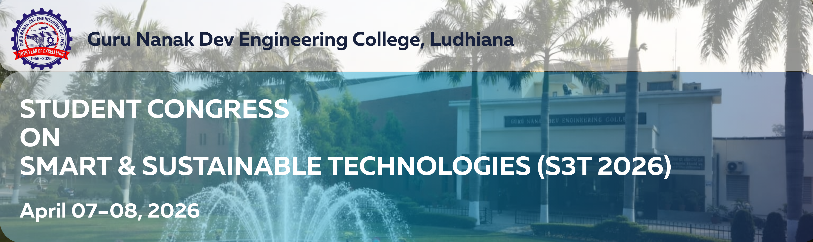

<h1 align="center">S3T 2026</h1>

<b>National Student Congress on Smart & Sustainable Technologies</b> 
Guru Nanak Dev Engineering College, Ludhiana

<a href="#home"><b>Home</b></a> •
<a href="#tracks"><b>Tracks</b></a> •
<a href="#important-dates"><b>Dates</b></a> •
<a href="#submission"><b>Submission</b></a> •
<a href="#committee"><b>Committee</b></a> •
<a href="#contact"><b>Contact</b></a>

---

## Home 

The **S3T 2026** is a national-level multidisciplinary congress providing a platform for **UG, PG students and research scholars** to present innovative ideas aligned with **Viksit Bharat @ 2047**.

---

## Conference Tracks 

<table width="100%">
<tr>

<td width="25%" valign="top" style="background:#eef6ff; padding:15px; border-radius:10px;">
<b style="color:#003366;">Civil Engineering</b> 
<i>Sustainable Infrastructure</i>
<ul>
<li>Structural Health Monitoring</li>
<li>Sustainable Materials</li>
<li>Smart Cities</li>
<li>Geotechnical Engineering</li>
<li>Transportation</li>
<li>Water & Environment</li>
</ul>
</td>

<td width="25%" valign="top" style="background:#fff5e6; padding:15px;">
<b style="color:#cc6600;">Electrical Engineering</b> 
<i>Smart Energy Systems</i>
<ul>
<li>Renewable Energy</li>
<li>Smart Grids</li>
<li>Power Electronics</li>
<li>Electric Vehicles</li>
<li>Energy Efficiency</li>
</ul>
</td>

<td width="25%" valign="top" style="background:#eefbea; padding:15px;">
<b style="color:#2c7a2c;">Electronics & Communication</b> 
<i>AI, IoT & Communication</i>
<ul>
<li>IoT Systems</li>
<li>AI/ML</li>
<li>VLSI</li>
<li>5G/6G</li>
<li>Biomedical Electronics</li>
</ul>
</td>

<td width="25%" valign="top" style="background:#f4f0ff; padding:15px;">
<b style="color:#5a3ea1;">Mechanical & Production</b> 
<i>Smart Manufacturing</i>
<ul>
<li>Automation</li>
<li>Robotics</li>
<li>Thermal Systems</li>
<li>Design Engineering</li>
<li>Simulation</li>
</ul>
</td>

</tr>
</table>

---

## Important Dates 

| Activity | Date |
|----------|------|
| Abstract Submission | ~~15 March~~ **18 March 2026 (Extended)** |
| Acceptance | 18 March 2026 |
| Registration | 20 March 2026 |
| Full Paper | 25 March 2026 |
| Final Acceptance | 30 March 2026 |
| Conference | 07–08 April 2026 |

---

## Submission & Registration 

<b>Abstract Submission</b> 
<a href="https://tinyurl.com/GNDEC-S3T-2026">Submit Here</a> 

<b>Full Paper Submission</b> 
<a href="https://tinyurl.com/GNDEC-S3T-2026-full%20paper">Submit Here</a> 

<b>Registration (After Acceptance)</b> 
<a href="https://tinyurl.com/GNDEC-S3T-2026-Registration">Register Here</a> 

> Each student author must register individually for certificate eligibility.

---

## Registration Payment Details

- **Account Name:** Students Chapter Institution of Engineers  
- **Bank:** Punjab & Sind Bank, Gill GNE Ludhiana  
- **Account No.:** 00211000082393  
- **IFSC Code:** PSIB0000021  

---

## Organizing Committee 

### Chief Patron

<b>Dr. Sehijpal Singh</b> 
Principal, GNDEC Ludhiana

---

### Patrons

Dr. Jagbir Singh • Dr. Munish Rattan • Dr. Kanwardeep Singh • Dr. Harmeet Singh

---

### Convenors

Dr. Yuvraj Singh • Dr. Gurpuneet Kaur • Dr. Chahat Jain • Dr. Arvind Dhingra 
Dr. Raman Kumar • Dr. Chamkaur Jindal

---

### Advisory Committee

Dr. Harvinder Singh • Dr. Puneetpal Singh Cheema • Dr. Prashant Garg • Dr. Narwant Singh Grewal 
Dr. Baljeet Kaur • Pf. Preetinder Singh • Er. Rupinderjit Singh • Dr. Jasmaninder Singh Grewal • Dr. Prem Singh

---

### Organising Committee

<table width="100%">
<tr>
<th>Civil</th>
<th>Electrical</th>
<th>ECE</th>
<th>MPE</th>
</tr>

<tr>
<td align="center">
Er. Charnjeet Singh 
Er. Amandeep Singh 
Er. Sukhwinderpal Singh
</td>

<td align="center">
Dr. Mandeep Kaur 
Dr. Ranvir Kaur 
Er. Balwinder Singh
</td>

<td align="center">
Er. Harminder Kaur 
Dr. Gurjot Kaur Walia 
Er. Kuldeepak Singh
</td>

<td align="center">
Dr. Jatinder Pal 
Dr. Gulvir Singh 
Er. Jagjit Kaur
</td>
</tr>

</table>

---

## Contact 

<b>Conference Secretariat – S3T 2026</b> 
Guru Nanak Dev Engineering College, Ludhiana  

Email: s3t.gndec@gmail.com  

Dr. Yuvraj Singh: +91 9815830889  
Dr. Arvind Dhingra: +91 9814163429  
Dr. Chahat Jain: +91 7837005620  
Dr. Raman Kumar: +91 9855100530  

---

Guru Nanak Dev Engineering College, Ludhiana 
Innovation • Sustainability • Engineering for the Future  
© 2026 S3T Congress

